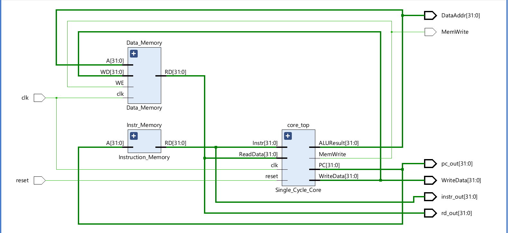
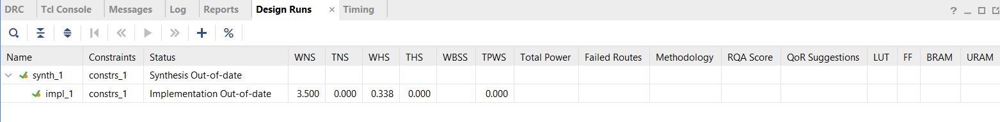
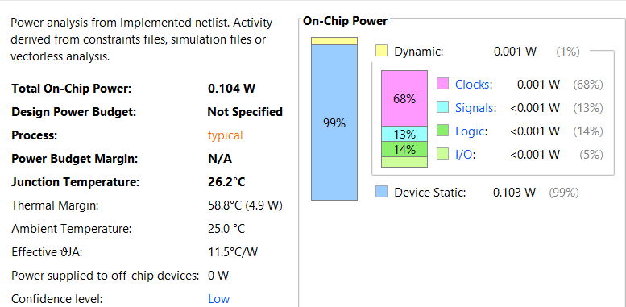

# SMVDU-AHO-32: 32-bit Single-Cycle RISC-V Processor (RV32I)

A complete end-to-end implementation of a custom **32-bit single-cycle RISC-V processor** based on the **RV32I ISA**, designed in **Verilog HDL**, verified through **RTL simulation**, prototyped on **Xilinx PYNQ-Z2 FPGA**, and validated through implementation reports including timing, power, and physical placement analysis.

---

## Project Overview

SMVDU-AHO-32 is a custom-built 32-bit Harvard architecture RISC-V processor implementing the RV32I base integer instruction set.

This project demonstrates the full digital design workflow:

- RTL microarchitecture design
- Functional simulation & verification
- FPGA synthesis & implementation
- Timing closure analysis
- Power estimation
- Hardware validation on FPGA
- Physical floorplanning / placement visualization

The processor follows a **single-cycle datapath**, where each instruction completes in one clock cycle.

---

## Key Features

- RV32I ISA support
- Single-cycle processor architecture
- Harvard architecture
- 32 × 32-bit register file
- Arithmetic & logical instruction support
- Load/store memory operations
- Branch & jump instructions
- Immediate generation unit
- Modular Verilog implementation
- FPGA deployment on PYNQ-Z2
- Timing-clean implementation

---

## Supported Instructions

### R-Type
- ADD
- SUB
- SLL
- SLT
- XOR
- SRL
- SRA
- OR
- AND

### I-Type
- ADDI
- SLTI
- XORI
- ORI
- ANDI
- SLLI
- LW
- JALR

### S-Type
- SW
- SH
- SB

### B-Type
- BEQ
- BNE
- BLT
- BGE
- BLTU
- BGEU

### U-Type
- LUI
- AUIPC

### J-Type
- JAL

---

# Architecture

## Block Diagram

<p align="center">
  
</p>

---

## Datapath Components

The processor consists of:

- Program Counter (PC)
- Instruction Memory
- Register File
- Immediate Generator
- Arithmetic Logic Unit (ALU)
- Main Control Unit
- ALU Decoder
- Data Memory
- Branch/Jump Logic
- Multiplexer Network

---

## Processor Microarchitecture

| Parameter | Specification |
|---------|--------------|
| ISA | RV32I |
| Datapath | Single Cycle |
| Architecture | Harvard |
| Register File | 32 × 32-bit |
| HDL | Verilog |
| FPGA | Xilinx PYNQ-Z2 |
| FPGA Device | XC7Z020 |
| Clocking | Single synchronous domain |

---

# RTL Design

## RTL Netlist

<p align="center">
  
</p>

---

# Functional Verification

## Simulation Waveform

This waveform verifies correct execution of instruction fetch, decode, ALU execution, memory access, and write-back.

<p align="center">
  
</p>

### Signals Observed

- clk
- reset
- pc_out
- instr_out
- WriteData
- DataAdr
- rd_out
- MemWrite

---

# FPGA Implementation

## Target Platform

**Board:** Xilinx PYNQ-Z2  
**Device:** Zynq-7000 XC7Z020

---

## Hardware Deployment

Bitstream successfully programmed onto FPGA board.

<p align="center">
  
</p>

---

# Timing Analysis

Implementation timing summary:

| Metric | Value |
|--------|------|
| WNS | +3.500 ns |
| TNS | 0.000 ns |
| WHS | +0.338 ns |
| THS | 0.000 ns |

### Interpretation

✅ No setup violations  
✅ No hold violations  
✅ Timing closure achieved

---

## Vivado Timing Report

<p align="center">
  
</p>

---

# Power Analysis

## On-Chip Power Report

| Parameter | Value |
|----------|------|
| Total Power | 0.104 W |
| Dynamic Power | 0.001 W |
| Static Power | 0.103 W |

### Observation

The processor logic consumes minimal dynamic power; most power is due to FPGA static leakage.

<p align="center">
  
</p>

---

# Physical Implementation View

## FPGA Placement / Floorplan

Visualization of logic placement across FPGA fabric.

<p align="center">
  
</p>

---

# Repository Structure

```bash
riscv-single-cycle/
│
├── rtl/
│   ├── top.v
│   ├── pc.v
│   ├── alu.v
│   ├── register_file.v
│   ├── control_unit.v
│   ├── alu_decoder.v
│   ├── immediate_generator.v
│   ├── instruction_memory.v
│   ├── data_memory.v
│
├── testbench/
│   └── tb_top.v
│
├── constraints/
│   └── design.xdc
│
├── bitstream/
│   └── processor.bit
│
├── images/
│   ├── block_diagram.png
│   ├── rtl_netlist.png
│   ├── simulation_waveform.png
│   ├── fpga_board.jpg
│   ├── timing_report.png
│   ├── power_report.png
│   └── floorplan.png
│
└── README.md