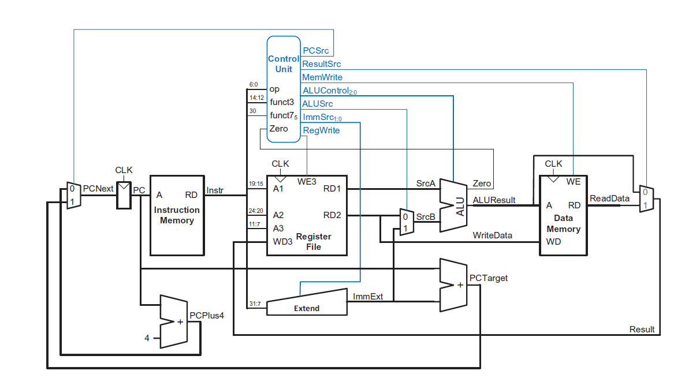
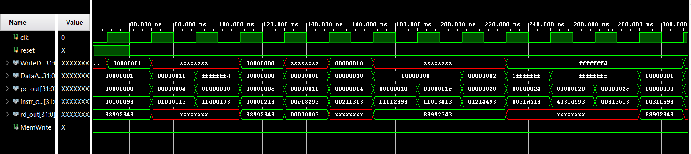
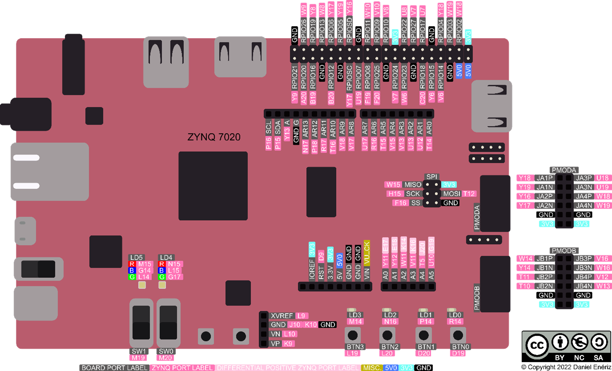
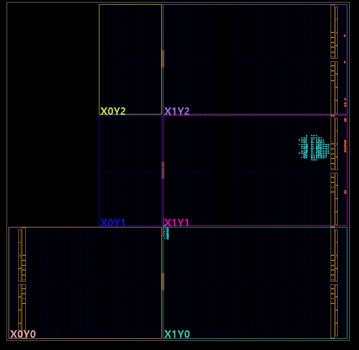
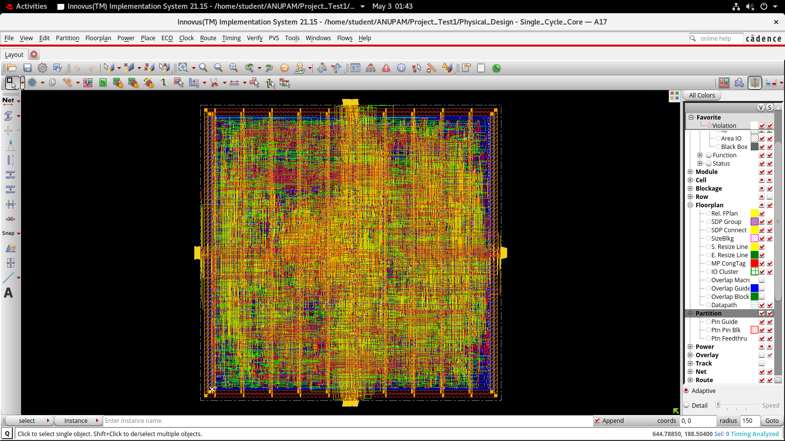
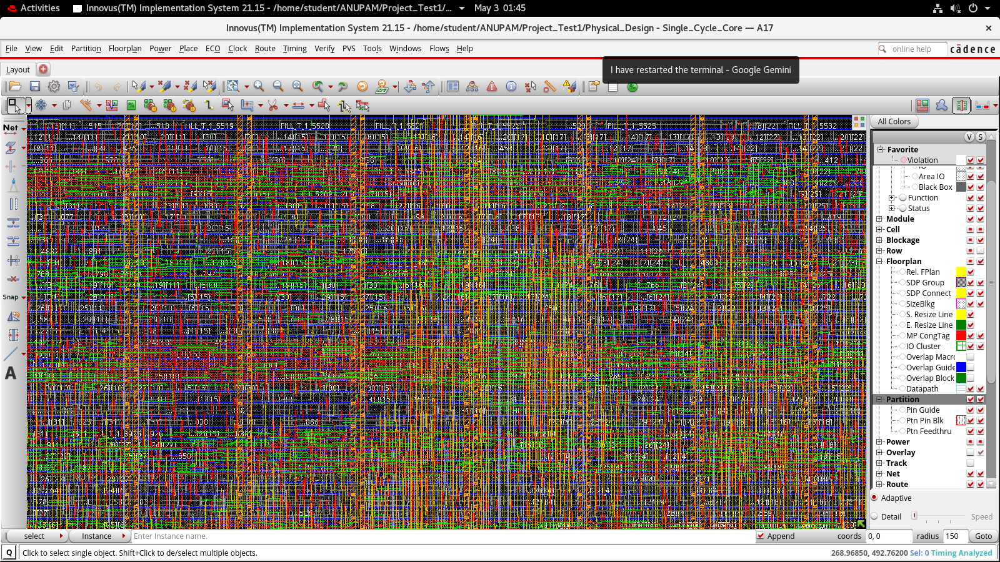
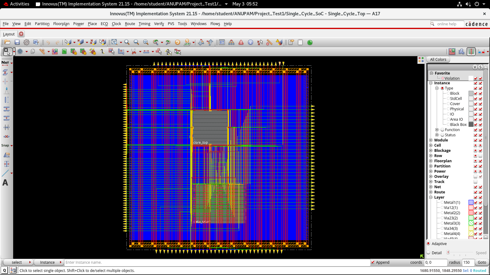

# SMVDU-AHO-32: 32-bit Single-Cycle RISC-V Processor (RV32I)

A complete end-to-end implementation of a custom **32-bit single-cycle RISC-V processor** based on the **RV32I ISA**, designed in **Verilog HDL**, functionally verified through simulation, prototyped on **Xilinx PYNQ-Z2 FPGA**, and fully implemented through a custom **ASIC physical design flow (Synthesis, DFT, ATPG, LEC, and Layout)** using Cadence tools.

---

## Project Overview

SMVDU-AHO-32 is a custom-designed **32-bit Harvard Architecture RISC-V processor** implementing the **RV32I base integer instruction set architecture**.

This project demonstrates a complete digital hardware design workflow from RTL development to FPGA deployment.

### Design Workflow
- RTL microarchitecture design in Verilog HDL
- Functional simulation and verification
- FPGA synthesis and implementation using Vivado
- Timing closure analysis
- Power estimation
- FPGA hardware validation
- RTL netlist generation
- Physical floorplanning visualization

The processor follows a **single-cycle datapath architecture**, where each instruction completes in one clock cycle.

---

## Key Features

- 32-bit RV32I compliant processor
- Single-cycle datapath architecture
- Harvard architecture
- Modular RTL design
- 32 × 32-bit register file
- Arithmetic and logical operations
- Immediate generation support
- Branch and jump execution
- Load/store memory instructions
- FPGA implementation on PYNQ-Z2
- Timing-clean synthesized design
- Low power FPGA implementation

---

## Supported Instructions

### R-Type Instructions
- ADD
- SUB
- SLL
- SLT
- XOR
- SRL
- SRA
- OR
- AND

### I-Type Instructions
- ADDI
- SLTI
- XORI
- ORI
- ANDI
- SLLI
- LW
- JALR

### S-Type Instructions
- SW
- SH
- SB

### B-Type Instructions
- BEQ
- BNE
- BLT
- BGE
- BLTU
- BGEU

### U-Type Instructions
- LUI
- AUIPC

### J-Type Instructions
- JAL

---

# Architecture

## Processor Block Diagram

<p align="center">
  
</p>

---

## Core Datapath Components

The processor includes:

- Program Counter (PC)
- Instruction Memory
- Register File
- Immediate Generator
- Arithmetic Logic Unit (ALU)
- Main Decoder
- ALU Decoder
- Data Memory
- Branch Control Logic
- PC Selection Logic
- Multiplexer Network

---

## Microarchitecture Specifications

| Parameter | Specification |
|---------|--------------|
| ISA | RV32I |
| Processor Width | 32-bit |
| Datapath | Single Cycle |
| Architecture | Harvard |
| Register File | 32 × 32-bit |
| HDL | Verilog |
| FPGA Board | Xilinx PYNQ-Z2 |
| FPGA Device | XC7Z020 |
| Clock Domain | Single synchronous |

---

# RTL Design

## RTL Netlist View

<p align="center">
  
</p>

---

# Functional Verification

## Simulation Waveform

Functional simulation validating:

- Instruction fetch
- Instruction decode
- ALU execution
- Memory access
- Register write-back
- Branch execution

<p align="center">
  
</p>

---

## Key Signals Observed

- clk
- reset
- pc_out
- instr_out
- WriteData
- DataAdr
- rd_out
- MemWrite

---

# FPGA Implementation

## Target Hardware

**Board:** Xilinx PYNQ-Z2  
**FPGA Device:** XC7Z020

---

## Hardware Validation

Successful deployment and execution on FPGA board.

<p align="center">
  
</p>

---

# Timing Analysis

## Implementation Timing Summary

| Metric | Value |
|--------|------|
| WNS | +3.500 ns |
| TNS | 0.000 ns |
| WHS | +0.338 ns |
| THS | 0.000 ns |

### Results
✅ No setup violations  
✅ No hold violations  
✅ Timing closure achieved

---

## Vivado Timing Report

<p align="center">
  
</p>

---

# Power Analysis

## FPGA Power Summary

| Parameter | Value |
|----------|------|
| Total Power | 0.104 W |
| Dynamic Power | 0.001 W |
| Static Power | 0.103 W |

### Observation

Dynamic logic power remains minimal, with static FPGA leakage dominating total power consumption.

<p align="center">
  
</p>

---

# Physical Implementation

## FPGA Floorplanning

Placement visualization of synthesized logic across FPGA fabric.

<p align="center">
  
</p>

---

## ASIC Physical Design (Cadence Innovus)

A complete physical implementation of the processor using **Cadence Innovus System**.

### 1. 32-bit Single-Cycle RISC-V Core Layout
Fully routed core layout displaying standard cell placement and clock tree synthesis (CTS).

<p align="center">
  
</p>

*Zoomed-in routing detail of the RISC-V Core:*
<p align="center">
  
</p>

### 2. Single-Cycle SoC Layout
Full SoC floorplan integrating the core top logic along with memory macros and surrounding pin connections.

<p align="center">
  
</p>

---

# Repository Structure

```bash
RISCV_CPU/
│
├── asic/
│   ├── ATPG/                     # Automatic Test Pattern Generation files
│   ├── DFT/                      # Design for Testability scripts & netlists
│   ├── FUNCTIONAL_VERIFICATION/   # Functional verification simulation environment
│   ├── GLS/                      # Gate-Level Simulation results
│   ├── Golden_Design_RTL/        # ASIC-specific golden Verilog design files
│   ├── Golden_Run/               # Simulation run logs & reports
│   ├── LEC/                      # Logic Equivalence Checking setup (Cadence Conformal)
│   ├── LEC_DFT_Netlist/          # Post-DFT Logic Equivalence Checking files
│   ├── Memory_Macros/            # Memory configuration macro models
│   ├── Physical_Design/          # Cadence Innovus layout & CTS outputs
│   ├── SMVDU_AHO32_Final_Delivery/# Sign-off delivery materials
│   ├── SMVDU_AHO32_Signoff/      # Sign-off timing, power, & DRC/LVS reports
│   ├── Single_Cycle_SoC/         # Full SoC level physical design flow
│   ├── Synthesis/                # Cadence Genus synthesis scripts & outputs
│   ├── TESTBENCHES/              # Comprehensive testbenches (including Exhaustive_TB)
│   └── coverage/                 # Code coverage analysis runs
│
├── constr/
│   ├── FPGA_single_cycle.xdc
│   └── master xdc pynq z2.txt
│
├── docs/
│   ├── datasheet/
│   │   └── pynqz2_user_manual_v1_0-1525725.pdf
│   │
│   └── report/
│       ├── desktop.ini
│       └── Minor Report - VIth.pdf
│
├── images/
│   ├── aho_micro.png
│   ├── core_layout_zoomed_in.png # Zoomed-in Core Layout (Innovus)
│   ├── core_layout_zoomed_out.png# Full Core Layout (Innovus)
│   ├── floorplan_fpga.png
│   ├── fpga_board.png
│   ├── power_report.png
│   ├── rtl_netlist.png
│   ├── sim_pynq.png
│   ├── sim_waveform.png
│   ├── soc_layout.png            # SoC Layout integrating memories (Innovus)
│   └── timing_report.png
│
├── resources/
│   └── Resources_for_fpga_and_rtl.pdf
│
├── rtl/
│   ├── design/
│   │   ├── ALU_decoder.v
│   │   ├── ALU_Mux.v
│   │   ├── ALU.v
│   │   ├── clk125_to_1hz.v
│   │   ├── Control_Unit.v
│   │   ├── Core_Datapath.v
│   │   ├── Data_Memory.v
│   │   ├── Extend.v
│   │   ├── Instruction_Memory.v
│   │   ├── Main_Decoder.v
│   │   ├── PC_Mux.v
│   │   ├── PC_Plus_4.v
│   │   ├── PC_Target.v
│   │   ├── PC.v
│   │   ├── Register_File.v
│   │   ├── Result_Mux.v
│   │   ├── Single_Cycle_Core.v
│   │   ├── Single_Cycle_FPGA.v
│   │   └── Single_Cycle_Top.v
│   │
│   └── simulation/
│       └── Single_Cycle_TB.v
│
└── README.md
```

---

# Tools Used

- Verilog HDL
- Xilinx Vivado
- PYNQ-Z2 FPGA Board
- RV32I ISA Specification

---

# Author

Harsh Mishra, Anupam Sarashwat, Om Kumar

School of Electronics & Communication Engineering,

Shri Mata Vaishno Devi University Katra - 182320

Email: 23bec027@gmail.com, 23bec014@gmail.com, 23bec038@gmail.com

Developed as part of academic processor design and FPGA implementation work.